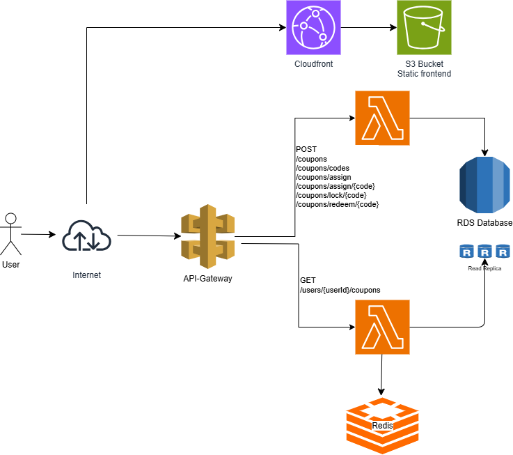
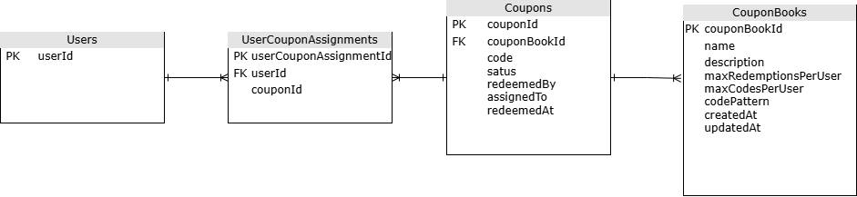

# Coupon Book Service
This repository contains the architecture and API definition for a coupon management service. Features include:

* Coupon book creation and management.
* User assignment and tracking of coupon usage.
* Atomic redemption operations with temporary locking to prevent double redemption.
* API-driven coupon redemption.
* Flexible coupon code generation based on patterns.
* Bulk upload of pre-generated coupon code lists.
* High-level architecture diagrams and API specifications.

## High Level Architectural Solution

## API Endpoints
The system exposes the following RESTful API endpoints:

| HTTP Method | Endpoint                | Description                                                                                                                                                                                 |
|-------------|-------------------------|---------------------------------------------------------------------------------------------------------------------------------------------------------------------------------------------|
| POST        | /coupons                | Creates a new coupon book. The request body should include parameters like the coupon book name, validity period, maximum redemptions per user, and code generation pattern.                |
| POST        | /coupons/codes          | Uploads a list of codes to an existing coupon book. This is optional, as codes can also be generated automatically. The request body should include the coupon book ID and a list of codes. |
| POST        | /coupons/assign         | Assigns a new random coupon code to a user from the specified coupon book. The request body should include the user ID and the coupon book ID.                                              |
| POST        | /coupons/assign/{code}  | Assigns a specific coupon code to a user. The request body should include the user ID and the coupon code.                                                                                  |
| POST        | /coupons/lock/{code}    | Locks a coupon for redemption (temporary). This is typically used when a user initiates the redemption process to prevent other users from redeeming the same coupon.                       |
| POST        | /coupons/redeem/{code}  | Redeems a coupon (permanent). The request body may include information about the redemption context, such as the order ID or transaction details.                                           |
| GET         | /users/{userId}/coupons | Retrieves the user's assigned coupon codes, including their status (e.g., active, redeemed, expired).                                                                                       |

## High Level Database Design

| Table                 | Field                  | Description                                                      | Relationship               | Data Type    |
|-----------------------|------------------------|------------------------------------------------------------------|----------------------------|--------------|
| CouponBooks           | couponBookId           | Unique identifier for the coupon book                            | Primary Key                | INT          |
| CouponBooks           | name                   | Name of the coupon book                                          |                            | VARCHAR(255) |
| CouponBooks           | description            | Description of the coupon book                                   |                            | TEXT         |
| CouponBooks           | maxRedemptionsPerUser  | Maximum number of times a user can redeem coupons from this book |                            | INT          |
| CouponBooks           | maxCodesPerUser        | Maximum number of coupons from this book a user can be assigned  |                            | INT          |
| CouponBooks           | codePattern            | Pattern used for generating coupon codes (if applicable)         |                            | VARCHAR(255) |
| CouponBooks           | createdAt              | Timestamp of when the coupon book was created                    |                            | TIMESTAMP    |
| CouponBooks           | updatedAt              | Timestamp of when the coupon book was last updated               |                            | TIMESTAMP    |
| Coupons               | couponId               | Unique identifier for the coupon                                 | Primary Key                | INT          |
| Coupons               | couponBookId           | Coupon book this coupon belongs to                               | Foreign Key to CouponBooks | INT          |
| Coupons               | code                   | Unique code of the coupon within the book                        |                            | VARCHAR(255) |
| Coupons               | status                 | Status of the coupon (e.g. 'active'; 'inactive'; 'redeemed')     |                            | VARCHAR(255) |
| Coupons               | redeemedBy             | User ID who redeemed this coupon                                 | Foreign Key to Users       | INT          |
| Coupons               | assignedTo             | User ID to whom this coupon is assigned                          | Foreign Key to Users       | INT          |
| Coupons               | redeemedAt             | Timestamp of when the coupon was redeemed                        |                            | TIMESTAMP    |
| Users                 | userId                 | Unique identifier of the user                                    | Primary Key                | INT          |
| UserCouponAssignments | userCouponAssignmentId | Unique identifier for the assignment                             | Primary Key                | INT          |
| UserCouponAssignments | userId                 | User who is assigned the coupon                                  | Foreign Key to Users       | INT          |
| UserCouponAssignments | couponId               | Coupon that is assigned                                          | Foreign Key to Coupons     | INT          |

## High-Level Deployment Strategy

The AWS cloud provides a lot of options for deployment, in this case 

## Functional Requirements

| Functional Requirements                 | Description                                                                                                                                                                                            |
|-----------------------------------------|--------------------------------------------------------------------------------------------------------------------------------------------------------------------------------------------------------|
| Create Coupon Book                      | The system shall allow businesses to create new coupon books.                                                                                                                                          |
| Upload Coupon Codes                     | The system shall allow uploading a list of codes to a given coupon book.                                                                                                                               |
| Generate Coupon Codes                   | The system shall allow generating coupon codes following a pattern up to a specified total amount.                                                                                                     |
| Assign Coupon to User                   | The system shall allow assigning a coupon code to a user.                                                                                                                                              |
| Redeem Coupon                           | The system shall allow users to redeem coupons.                                                                                                                                                        |
| Lock Coupon                             | The system shall allow temporarily locking a coupon during redemption attempts.                                                                                                                        |
| Set Coupon Book Parameters              | The system shall allow setting parameters at the coupon book level, such as whether codes can be redeemed more than once per user and the maximum number of codes per coupon book assigned per member. |
| Get User's Assigned Coupons             | The system shall allow retrieving a list of coupon codes assigned to a user.                                                                                                                           |
| Redeem Coupon Multiple Times (Optional) | The system shall allow redeeming a coupon code multiple times per user based on a coupon book parameter.                                                                                               |
| Limit Codes per User (Optional)         | The system shall allow limiting the number of codes per coupon book assigned to a user based on a coupon book parameter.                                                                               |

## Non Functional Requirements

| Non-Functional Requirements | Description                                                                                                                        |
|-----------------------------|------------------------------------------------------------------------------------------------------------------------------------|
| Security                    | The system shall ensure secure access to coupon data and prevent unauthorized access.                                              |
| Performance                 | The system shall handle a high volume of requests efficiently.                                                                     |
| Concurrency                 | The system shall manage concurrent operations, especially coupon redemption, to prevent race conditions and data integrity issues. |
| Scalability                 | The system shall be able to scale to accommodate increasing numbers of users and coupons.                                          |
| Availability                | The system shall be highly available to ensure uninterrupted service.                                                              |
| Usability                   | The API shall be easy to use and understand for developers.                                                                        |
| Maintainability             | The system shall be easy to maintain and update.                                                                                   |
| Reliability                 | The system shall be reliable and consistently perform its functions correctly.                                                     |
| Deployability               | The system shall be easily deployable to a cloud platform like AWS or GCP.                                                         |
| Data Integrity              | The system shall ensure data integrity and consistency.                                                                            |

## Assumptions

- Only backend
- 

## Architectural Decisions

| Component       | Decision                                                                                                    |
|-----------------|-------------------------------------------------------------------------------------------------------------|
| API Gateway     | Handles API requests and routes them to appropriate Lambda functions.                                       |
| API Gateway     | Provides authentication and authorization using API keys or JWT tokens.                                     |
| API Gateway     | Manages API documentation using Swagger/OpenAPI.                                                            |
| Lambda          | Serverless compute for implementing API logic.                                                              |
| Lambda          | Separate Lambda functions for different API endpoints (e.g. create coupon; assign coupon; redeem coupon).   |
| Lambda          | Lambda functions written in Node.js.                                                                        |
| RDS             | Relational database for storing coupon books; coupons; and user assignments.                                |
| RDS             | Tables for coupon books; coupons; users; and user-coupon assignments.                                       |
| Node.js         | Node.js runtime for Lambda functions.                                                                       |
| Swagger/OpenAPI | Define API endpoints; request/response models; and authentication schemes.                                  |
| Swagger/OpenAPI | Generate API documentation for developers.                                                                  |
| Swagger/OpenAPI | Swagger UI for testing API endpoints.                                                                       |
| SQS             | SQS queues for decoupling asynchronous tasks (e.g. sending notifications; updating user points).            |
| SQS             | Lambda functions triggered by SQS events to process asynchronous tasks.                                     |
| Concurrency     | Use database transactions and row-level locking in RDS to handle concurrent requests for coupon redemption. |
| Security        | Implement input validation; output encoding; and rate limiting to prevent abuse.                            |
| Performance     | Optimize database queries and Lambda function execution time.                                               |
| Scalability     | Leverage AWS RDS features like read replicas and Aurora Serverless for scalability.                         |

## Additional Considerations
- Concurrency: Use optimistic locking in DynamoDB to handle concurrent requests for coupon redemption.
- Security: Implement input validation, output encoding, and rate limiting to prevent abuse.
- Performance: Optimize DynamoDB queries and Lambda function execution time.
- Scalability: Leverage AWS auto-scaling for Lambda functions and DynamoDB tables.
- Example Endpoint Implementation
POST /coupons/redeem/{code}

* Lambda function triggered by API Gateway.
* Retrieve coupon and user assignment from DynamoDB.
* Check if coupon is valid and not already redeemed.
* Use optimistic locking to update coupon status to 'redeemed'.
* Return success or error response.

## Reference architecture
- https://www.geeksforgeeks.org/design-coupon-and-voucher-management-system/